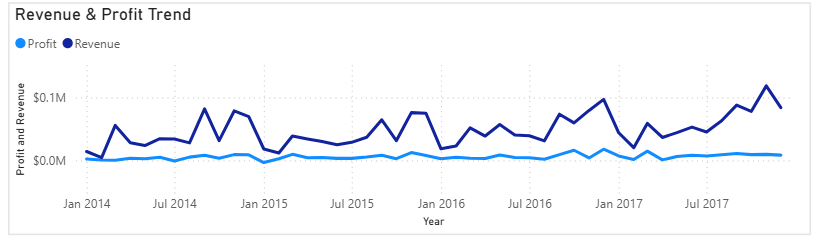
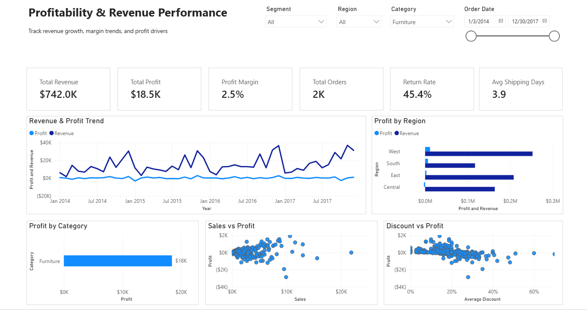
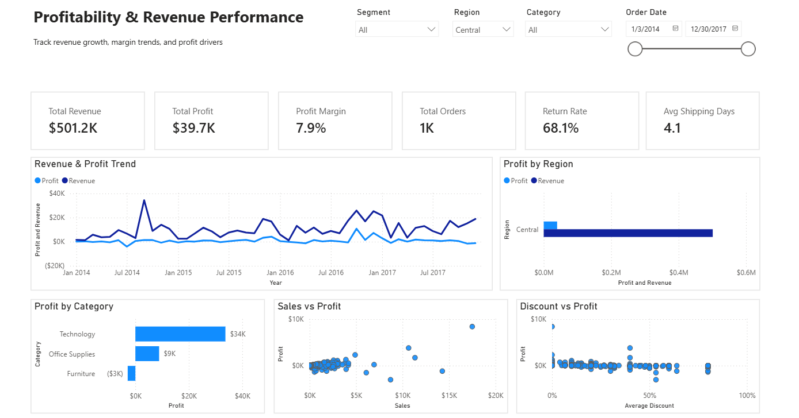
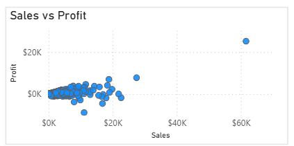
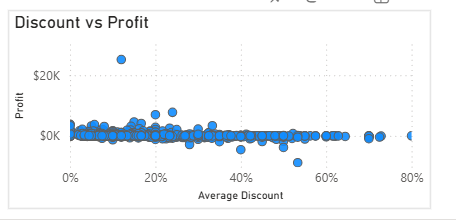

# Profitability & Revenue Performance Analysis Dashboard

## Business Problem

A mid-sized retail company is experiencing steady revenue growth but declining profit margins across certain categories and regions. 

Leadership suspects that aggressive discounting and inefficient product mix are driving profit leakage. However, there is no centralized system to monitor performance or identify the root causes.

As a result, decision-makers lack clear visibility into:
- Whether revenue growth is translating into profitability
- Which categories or regions are underperforming
- How discount strategies are impacting profit

## Objective

The objective of this project is to design and develop an interactive, insight-driven dashboard that enables stakeholders to monitor business performance and identify the key factors affecting profitability.

Specifically, the dashboard aims to:

- Evaluate whether revenue growth is translating into profit growth  
- Identify categories and regions contributing to profit or loss  
- Analyze the impact of discounting on profitability  
- Detect inefficiencies in product performance (high sales but low profit)  
- Compare performance across customer segments  
- Support data-driven decision-making for pricing, discount strategy, and product optimization  

This project is guided by the core business question:

**“Why is profitability not growing in line with revenue, and where should the business focus to improve margins?”**

## Dataset Overview

This project uses a retail transaction dataset sourced from Kaggle:

🔗 https://www.kaggle.com/datasets/soumyameshram/superstore-retail-profitability-dataset

The dataset represents a fictional Superstore and contains detailed information on customer orders, sales, profit, discounts, and shipping operations. It is commonly used for business analysis, profitability assessment, and forecasting tasks.

### Dataset Characteristics

- **Total Records:** 9,994  
- **Time Range:** January 2014 – December 2017  
- **Granularity:** Order-level transactions  

### Key Data Fields

- **Sales, Profit, Discount** → Core business metrics  
- **Order Date, Ship Date** → Time-based analysis  
- **Category, Sub-Category, Product Name** → Product-level insights  
- **Region, State, City** → Geographic segmentation  
- **Segment (Consumer, Corporate, Home Office)** → Customer segmentation  
- **Quantity, Returns** → Operational indicators  

### Engineered Features (via SQL)

To support deeper analysis, additional features were created:

- `shipping_days` → Delivery duration  
- `order_year`, `order_month` → Time aggregation  
- `profit_margin` → Profitability efficiency  

This dataset enables comprehensive analysis of revenue performance, profit drivers, discount impact, and operational efficiency.

## Data Preparation

Data preparation was performed using SQL to ensure the dataset was clean, consistent, and ready for analysis. The process followed a structured pipeline covering cleaning, feature engineering, KPI creation, and validation.

### Data Cleaning
- Converted key columns to appropriate data types (numeric, date, boolean)  
- Removed redundant encoded identifier columns  

---

### Feature Engineering
- Created **shipping duration** (`shipping_days`)  
- Extracted **time features** (`order_year`, `order_month`)  
- Calculated **profit margin** (`profit_margin`)  

---

### KPI Preparation
Pre-aggregated metrics were created to support dashboard analysis:
- Total Sales  
- Total Profit  
- Total Orders  
- Average Profit Margin  
- Average Shipping Days  
- Return Rate  

---

### Data Validation
- Verified row counts and checked for missing values  
- Identified invalid records (e.g., negative sales, negative shipping duration)  
- Ensured consistency of calculated fields (profit margin)  

---

This structured preparation ensures the dataset is reliable and suitable for generating accurate business insights.

## Interactive Dashboard

An interactive dashboard was developed in Power BI to provide a comprehensive view of business performance and enable dynamic analysis across multiple dimensions.

The dashboard is designed following a structured analytical flow:
**Overview → Trends → Drivers → Segmentation**

### Key Components

- **Executive KPIs**
  - Total Revenue  
  - Total Profit  
  - Profit Margin  
  - Total Orders  
  - Return Rate  
  - Average Shipping Days  

- **Performance Trends**
  - Revenue and Profit over time to evaluate growth vs profitability  

- **Profitability Analysis**
  - Profit by Category to identify high and low performing segments  
  - Sales vs Profit to detect inefficiencies in product performance  

- **Discount Impact**
  - Discount vs Profit to assess the effect of discounting on margins  

- **Regional Performance**
  - Revenue and Profit by Region to identify geographical strengths and weaknesses  

- **Interactive Filtering**
  - Users can filter by **Region, Segment, Category, and Order Date**  
  - Enables flexible exploration and deeper analysis  

This design allows stakeholders to quickly assess business health and drill down into specific areas of concern.

## Key Insights

### 1. Revenue Growth is Not Translating into Profit Growth

Revenue shows a consistent upward trend from 2014 to 2017. However, profit remains relatively flat and significantly lower in comparison.

This indicates a clear disconnect between sales growth and profitability, suggesting inefficiencies in pricing, discounting, or cost structure.

---

### 2. Furniture Category is Driving Low Profitability

When isolating the Furniture category:

- **Revenue:** ~$742K  
- **Profit:** ~$18.5K  
- **Profit Margin:** ~2.5%  
- **Return Rate:** ~45.4%  

Despite generating substantial revenue, Furniture contributes minimal profit and exhibits a high return rate, indicating serious margin and operational issues.

---

### 3. Central Region Underperforms in Profit

For the Central region:

- **Revenue:** ~$501.2K  
- **Profit:** ~$39.7K  
- **Profit Margin:** ~7.9%  
- **Return Rate:** ~68.1%  

The region shows weak profitability and an extremely high return rate, suggesting inefficiencies in regional strategy, product performance, or customer satisfaction.

---

### 4. High Sales Do Not Always Translate into Profit

The scatter plot reveals multiple instances where higher sales are associated with low or negative profit.

This highlights:
- Inefficient pricing strategies  
- Sales driven by heavy discounting  
- Poor product-level profitability  

---

### 5. Discounting is a Major Driver of Profit Loss

A clear negative relationship exists between discount levels and profit.

Higher discount levels consistently correspond to lower or negative profit, confirming that aggressive discounting is a key contributor to margin erosion.

---

### 6. Segment Analysis Reveals Profitability Trade-offs

- **Consumer Segment**
  - Revenue: ~$1.2M  
  - Profit: ~$134.1K  
  - Primary driver of overall revenue and profit  

- **Corporate Segment**
  - Revenue: ~$706.1K  
  - Profit: ~$92.0K  
  - Balanced performance  

- **Home Office Segment**
  - Revenue: ~$429.7K  
  - Profit: ~$60.3K  
  - Highest profit margin (~14%)  

This indicates that while the Consumer segment drives volume, the Home Office segment operates more efficiently in terms of profitability.

## Business Recommendations

Based on the analysis, the following actions are recommended to improve profitability and operational efficiency:

---

### 1. Optimize Discount Strategy

- Implement stricter controls on high discount levels  
- Identify products consistently sold at low or negative margins  
- Introduce discount thresholds to prevent profit erosion  

Rationale:  
Higher discounts are strongly associated with lower or negative profit.

---

### 2. Re-evaluate Furniture Category Strategy

- Review pricing and cost structure of Furniture products  
- Reduce excessive discounting within the category  
- Identify underperforming products and consider removal or repositioning  

Rationale:  
Furniture generates significant revenue but extremely low profit (~2.5% margin), indicating inefficiency.

---

### 3. Improve Performance in the Central Region

- Investigate causes of high return rate (~68%)  
- Analyze customer satisfaction, logistics, and product suitability  
- Adjust regional pricing or product mix  

Rationale:  
The Central region shows weak profitability and operational inefficiencies.

---

### 4. Focus on High-Margin Segments

- Increase focus on Home Office customers  
- Identify high-margin products within this segment  
- Develop targeted marketing strategies  

Rationale:  
Home Office segment delivers the highest profit margin despite lower revenue.

---

### 5. Address Product-Level Profitability Issues

- Identify high-sales but low-profit products  
- Adjust pricing or reduce discounting for such products  
- Monitor product-level performance regularly  

Rationale:  
High sales volumes are not consistently translating into profit.

---

### 6. Reduce Return Rates

- Investigate reasons behind high return rates  
- Improve product quality, descriptions, and delivery reliability  
- Implement return reduction strategies  

Rationale:  
High return rates negatively impact profitability and operational efficiency.

## Tools & Technologies Used

- Power BI — dashboard development and data visualization  
- SQL (PostgreSQL) — data cleaning, transformation, and feature engineering   
- Kaggle — dataset source  

## How to Use the Dashboard

The dashboard supports interactive exploration:

- Use slicers to filter by:
  - Region  
  - Segment  
  - Category  
  - Order Date  

- Analyze:
  - Overall performance using KPI cards  
  - Trends using the line chart  
  - Profit drivers using category and scatter plots  

- Combine filters to examine specific business scenarios  

## Project Structure

project-root/
│
├── data/
│   └── superstore_data.csv
│
├── sql/
│   ├── 01_data_cleaning.sql
│   ├── 02_feature_engineering.sql
│   ├── 03_kpi_views.sql
│   └── 04_validation_checks.sql
│
├── dashboard/
│   └── profitability_dashboard.pbix
│
├── images/
│   ├── dashboard_overview.png
│   ├── revenue_profit_trend.png
│   ├── weak_category_profit.png
│   ├── weak_region_profit.png
│   ├── sales_vs_profit.png
│   └── discount_vs_profit.png
│
└── README.md

## Conclusion

This project demonstrates how data can be transformed into actionable business insights through structured analysis and effective visualization.

The dashboard shows that while revenue is increasing, profitability is constrained by aggressive discounting, underperforming categories, and regional inefficiencies.

Addressing these issues through targeted pricing strategies, product optimization, and operational improvements can lead to stronger margins and better business outcomes.

This work highlights the importance of combining data preparation, analytical thinking, and visualization to support informed decision-making.