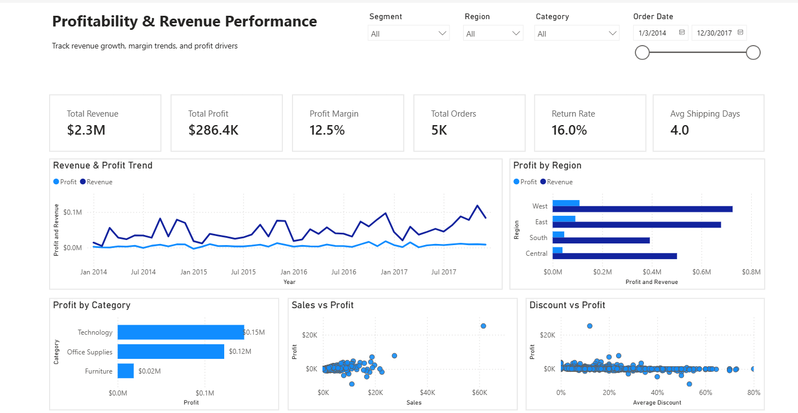

# Profitability & Revenue Performance Analysis Dashboard

## Business Problem

A mid-sized retail company is experiencing steady revenue growth but declining profit margins across certain categories and regions. 

Leadership suspects that aggressive discounting and inefficient product mix are driving profit leakage. However, there is no centralized system to monitor performance or identify the root causes.

As a result, decision-makers lack clear visibility into:
- Whether revenue growth is translating into profitability
- Which categories or regions are underperforming
- How discount strategies are impacting profit

## 🎯 Objective

The objective of this project is to design and develop an interactive, insight-driven dashboard that enables stakeholders to monitor business performance and identify the key factors affecting profitability.

Specifically, the dashboard aims to:

- Evaluate whether revenue growth is translating into profit growth  
- Identify categories and regions contributing to profit or loss  
- Analyze the impact of discounting on profitability  
- Detect inefficiencies in product performance (high sales but low profit)  
- Compare performance across customer segments  
- Support data-driven decision-making for pricing, discount strategy, and product optimization  

This project is guided by the core business question:

**“Why is profitability not growing in line with revenue, and where should the business focus to improve margins?”**

## 📂 Dataset Overview

This project uses a retail transaction dataset sourced from Kaggle:

🔗 https://www.kaggle.com/datasets/soumyameshram/superstore-retail-profitability-dataset

The dataset represents a fictional Superstore and contains detailed information on customer orders, sales, profit, discounts, and shipping operations. It is commonly used for business analysis, profitability assessment, and forecasting tasks.

### 📊 Dataset Characteristics

- **Total Records:** 9,994  
- **Time Range:** January 2014 – December 2017  
- **Granularity:** Order-level transactions  

### 🧾 Key Data Fields

- **Sales, Profit, Discount** → Core business metrics  
- **Order Date, Ship Date** → Time-based analysis  
- **Category, Sub-Category, Product Name** → Product-level insights  
- **Region, State, City** → Geographic segmentation  
- **Segment (Consumer, Corporate, Home Office)** → Customer segmentation  
- **Quantity, Returns** → Operational indicators  

### 🔧 Engineered Features (via SQL)

To support deeper analysis, additional features were created:

- `shipping_days` → Delivery duration  
- `order_year`, `order_month` → Time aggregation  
- `profit_margin` → Profitability efficiency  

This dataset enables comprehensive analysis of revenue performance, profit drivers, discount impact, and operational efficiency.

## 🛠️ Data Preparation

Data preparation was performed using SQL to ensure the dataset was clean, consistent, and ready for analysis. The process followed a structured pipeline covering cleaning, feature engineering, KPI creation, and validation.

### Data Cleaning
- Converted key columns to appropriate data types (numeric, date, boolean)  
- Removed redundant encoded identifier columns  

---

### Feature Engineering
- Created **shipping duration** (`shipping_days`)  
- Extracted **time features** (`order_year`, `order_month`)  
- Calculated **profit margin** (`profit_margin`)  

---

### KPI Preparation
Pre-aggregated metrics were created to support dashboard analysis:
- Total Sales  
- Total Profit  
- Total Orders  
- Average Profit Margin  
- Average Shipping Days  
- Return Rate  

---

### Data Validation
- Verified row counts and checked for missing values  
- Identified invalid records (e.g., negative sales, negative shipping duration)  
- Ensured consistency of calculated fields (profit margin)  

---

This structured preparation ensures the dataset is reliable and suitable for generating accurate business insights.

## 📊 Interactive Dashboard

An interactive dashboard was developed in Power BI to provide a comprehensive view of business performance and enable dynamic analysis across multiple dimensions.

The dashboard is designed following a structured analytical flow:
**Overview → Trends → Drivers → Segmentation**

### Key Components

- **Executive KPIs**
  - Total Revenue  
  - Total Profit  
  - Profit Margin  
  - Total Orders  
  - Return Rate  
  - Average Shipping Days  

- **Performance Trends**
  - Revenue and Profit over time to evaluate growth vs profitability  

- **Profitability Analysis**
  - Profit by Category to identify high and low performing segments  
  - Sales vs Profit to detect inefficiencies in product performance  

- **Discount Impact**
  - Discount vs Profit to assess the effect of discounting on margins  

- **Regional Performance**
  - Revenue and Profit by Region to identify geographical strengths and weaknesses  

- **Interactive Filtering**
  - Users can filter by **Region, Segment, Category, and Order Date**  
  - Enables flexible exploration and deeper analysis  

This design allows stakeholders to quickly assess business health and drill down into specific areas of concern.